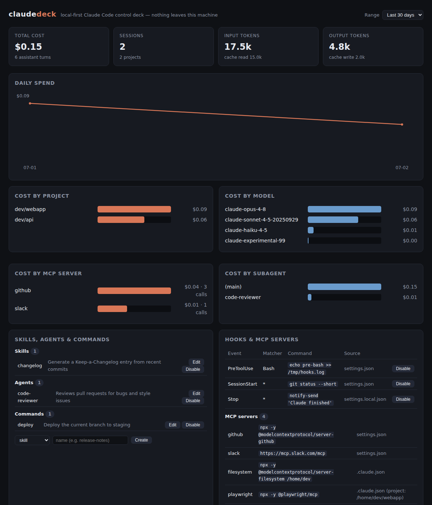
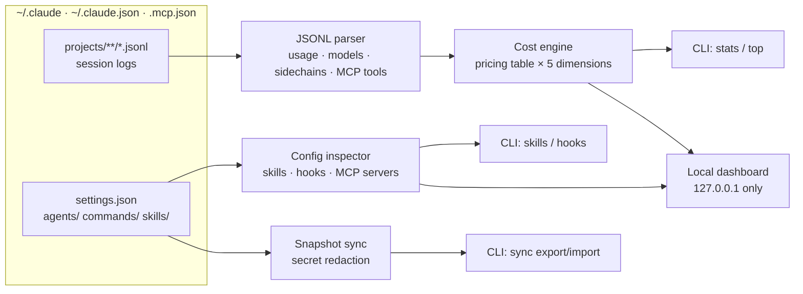

# claudedeck

[English](README.md) | [中文](README.zh.md) | [日本語](README.ja.md)

[](LICENSE) 

**Claude Code のオープンソース・local-first 管理コンソール。MCP サーバー単位のコスト帰属、skills / hooks エディタ、設定同期。**



```bash
git clone https://github.com/JaydenCJ/claudedeck.git && cd claudedeck
npm install && npm run build && npm link
```

## なぜ claudedeck なのか

Claude Code は `~/.claude` に豊富なセッションログと設定を書き込みますが、本当に知りたいコストの答えは 4 つの層（ローカル JSONL、`/cost`、Console、gateway）に散らばっています。MCP サーバーごとの費用を計測するツールはなく、skills / hooks / 設定はファイルの手編集頼みです。claudedeck はローカルログを完全オフラインで解析し、これらすべてに 1 つのツールで答えます。データがマシンの外に出ることはありません。

|  | claudedeck | ccusage | claude-mem |
|---|---|---|---|
| MCP サーバー単位のコスト | yes | no | no |
| コストの次元 | project · date · model · subagent · MCP server | date · session · block · model | no cost metering |
| skills / hooks の編集（CLI + dashboard） | yes | no | no |
| マシン間の設定スナップショット同期 | yes | no | no |

## 特徴

- **MCP サーバー単位のコスト計測** — 他のツールにはない次元です。各ターンのコストをそのターンが呼び出した MCP サーバーに帰属させ、各バケットの合計は常に総コストに一致します。
- **5 次元のコスト帰属** — プロジェクト、日付、モデル、subagent、MCP サーバー。すべてローカルの JSONL セッションログから計算します。
- **実測ベースの subagent 会計** — sidechain のターンを起動元の `Task` 呼び出しまで解決するため、`code-reviewer` 対 `(main)` のコストは推測ではなく実測です。
- **skills / hooks エディタ** — CLI からもダッシュボードからも、skills・agents・スラッシュコマンドの閲覧・新規作成・本文編集・有効/無効化ができます。hooks の無効化は非破壊的（`disabledHooks` セクションへ移動）で、いつでも元に戻せます。
- **ポータブルな設定スナップショット** — `sync export` が `settings.json` + agents + commands + skills + `CLAUDE.md` を 1 つの JSON にまとめます。シークレット（API キー、トークン）はデフォルトで除去され、除去箇所はすべて一覧されます。`sync import` で別マシンに適用できます。
- **ゼロアップロード** — ダッシュボードは `127.0.0.1` にバインドし、CSS/JS はすべてインライン。ネットワークリクエストもテレメトリも一切ありません。
- **スクリプト向け CLI** — すべてのコマンドがパイプライン用の `--json` に対応し、`--since` / `--until` / `--dir` フィルタも使えます。gateway や独自レートは JSON ファイル 1 つで上書きできます。

## クイックスタート

インストール:

```bash
git clone https://github.com/JaydenCJ/claudedeck.git && cd claudedeck
npm install && npm run build && npm link
```

最小の例を実行します:

```bash
claudedeck stats            # totals + per-model + per-project breakdown
claudedeck top --by mcp     # cost per MCP server
claudedeck serve            # dashboard at http://127.0.0.1:7433
```

出力:

```text
$ claudedeck top --by mcp
Top mcp by cost — .../.claude
mcp                                cost  calls  turns
------  ------------------------  -----  -----  -----
github  ████████████████████████  $0.04      3      2
slack   ██████████                $0.01      1      1
```

Linux / macOS / Windows 向けのビルド済み単一バイナリ（Node.js 不要）は、今後のリリースで提供予定です。現時点では上記のソースからのインストールをご利用ください。

## 設定

| 項目 | 方法 |
|---|---|
| データディレクトリ | `--dir <path>` または `CLAUDE_CONFIG_DIR`（デフォルト `~/.claude`） |
| 価格の上書き | `~/.claude/claudedeck.pricing.json` または `--pricing <file>` — `claudedeck pricing --json` と同じ形式 |
| 機械可読出力 | 任意のコマンドに `--json` |
| ダッシュボードのポート/ホスト | `claudedeck serve -p 7433 --host 127.0.0.1` |

価格上書きの例（USD / 100 万トークン、最長のモデルプレフィックスが優先）:

```json
{
  "claude-opus-4-8": { "inputPerMTok": 5, "outputPerMTok": 25, "cacheWritePerMTok": 6.25, "cacheReadPerMTok": 0.5 },
  "my-gateway-model": { "inputPerMTok": 2, "outputPerMTok": 8, "cacheWritePerMTok": 2.5, "cacheReadPerMTok": 0.2 }
}
```

## アーキテクチャ



### MCP コスト帰属の仕組み

トークン使用量はツール呼び出し単位ではなく assistant ターン単位で課金されます。そのため claudedeck は各ターンのコストを、そのターンが呼び出した MCP サーバーに帰属させます（同一ターン内の複数サーバー間では均等割り）。MCP 呼び出しのないターンは `(no-mcp)` に入ります。これは近似ですが、保守的で、総和が保存され（各バケットの合計は常に総コストに一致）、「このサーバーには実際にお金がかかっている」をついに計測可能にします。

## ロードマップ

- [x] プロジェクト / 日付 / モデル / subagent / MCP サーバーの 5 次元コスト帰属（総額保存）
- [x] ダッシュボードでの skills・agents・スラッシュコマンドの本文編集
- [ ] ダッシュボードでの hook コマンド編集
- [ ] ライブフォローモード（`claudedeck serve --watch`）とストリーミング更新
- [ ] 予算アラート（`claudedeck watch --budget 50`）
- [ ] CSV / OpenTelemetry メトリクスへのエクスポート
- [ ] チームモード：複数マシンのスナップショットと統計のマージ（あくまでローカル）

全体は [open issues](https://github.com/JaydenCJ/claudedeck/issues) を参照してください。

## コントリビューション

コントリビューションを歓迎します。まずは [good first issue](https://github.com/JaydenCJ/claudedeck/issues?q=is%3Aissue+is%3Aopen+label%3A%22good+first+issue%22) から、または [issue](https://github.com/JaydenCJ/claudedeck/issues) でお気軽にどうぞ。開発環境・テスト・コミット規約は [CONTRIBUTING.md](CONTRIBUTING.md) を参照してください。

## ライセンス

[MIT](LICENSE)
