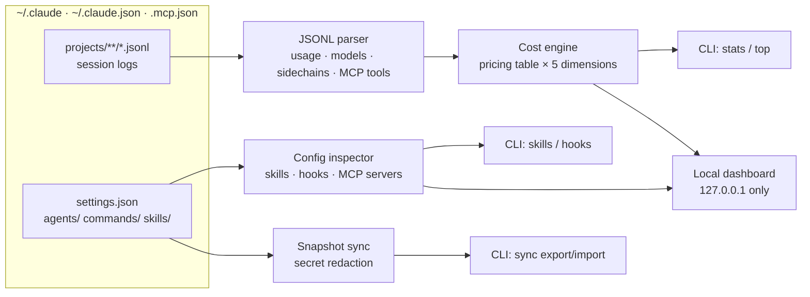

# claudedeck

[English](README.md) | [中文](README.zh.md) | [日本語](README.ja.md)

[](LICENSE) 

**Open-source, local-first control deck for Claude Code — cost per MCP server, a skills & hooks editor, config sync.**


```bash
git clone https://github.com/JaydenCJ/claudedeck.git && cd claudedeck
npm install && npm run build && npm link
```

## Why claudedeck?

Claude Code writes rich session logs and configuration to `~/.claude`, but the cost answers you actually need are scattered across four layers (local JSONL, `/cost`, Console, gateway), nothing meters what each MCP server costs you, and skills/hooks/config sit in hand-edited files. claudedeck parses your local logs offline and answers all of it in one tool — nothing leaves your machine.

|  | claudedeck | ccusage | claude-mem |
|---|---|---|---|
| Cost per MCP server | yes | no | no |
| Cost dimensions | project · date · model · subagent · MCP server | date · session · block · model | no cost metering |
| Skills & hooks editing (CLI + dashboard) | yes | no | no |
| Config snapshot sync across machines | yes | no | no |

## Features

- **Cost per MCP server** — the dimension nothing else meters: each turn's cost is attributed to the MCP server(s) it invoked, and bucket sums always equal the overall total.
- **Five-dimension attribution** — project, date, model, subagent and MCP server, all computed from your local JSONL session logs.
- **Real subagent accounting** — sidechain turns are resolved back to the `Task` call that spawned them, so `code-reviewer` vs `(main)` cost is measured, not guessed.
- **Skills & hooks editor** — browse, create, edit and toggle skills, agents and slash commands from the CLI or the dashboard; hooks are enabled/disabled non-destructively (moved to a `disabledHooks` section, fully reversible).
- **Portable config snapshots** — `sync export` packs `settings.json` + agents + commands + skills + `CLAUDE.md` into one JSON with secrets (API keys, tokens) stripped by default and every redaction listed; `sync import` applies it on another machine.
- **Zero upload** — the dashboard binds to `127.0.0.1`, inlines every byte of CSS/JS, makes no network requests and has no telemetry.
- **Scriptable CLI** — every command takes `--json` for pipelines, plus `--since` / `--until` / `--dir` filters; gateway or custom pricing is one JSON override file away.

## Quickstart

Install:

```bash
git clone https://github.com/JaydenCJ/claudedeck.git && cd claudedeck
npm install && npm run build && npm link
```

Run the minimal example:

```bash
claudedeck stats            # totals + per-model + per-project breakdown
claudedeck top --by mcp     # cost per MCP server
claudedeck serve            # dashboard at http://127.0.0.1:7433
```

Output:

```text
$ claudedeck top --by mcp
Top mcp by cost — .../.claude
mcp                                cost  calls  turns
------  ------------------------  -----  -----  -----
github  ████████████████████████  $0.04      3      2
slack   ██████████                $0.01      1      1
```

Prebuilt single binaries (no Node.js required) for Linux, macOS and Windows are planned for an upcoming release; until then, install from source as shown above.

## Configuration

| What | How |
|---|---|
| Data directory | `--dir <path>` or `CLAUDE_CONFIG_DIR` (default `~/.claude`) |
| Pricing overrides | `~/.claude/claudedeck.pricing.json` or `--pricing <file>` — same shape as `claudedeck pricing --json` |
| Machine-readable output | `--json` on any command |
| Dashboard port/host | `claudedeck serve -p 7433 --host 127.0.0.1` |

Example pricing override (USD per million tokens, longest model-prefix wins):

```json
{
  "claude-opus-4-8": { "inputPerMTok": 5, "outputPerMTok": 25, "cacheWritePerMTok": 6.25, "cacheReadPerMTok": 0.5 },
  "my-gateway-model": { "inputPerMTok": 2, "outputPerMTok": 8, "cacheWritePerMTok": 2.5, "cacheReadPerMTok": 0.2 }
}
```

## Architecture



### How MCP cost attribution works

Token usage is billed per assistant turn, not per tool call — so claudedeck attributes each turn's cost to the MCP server(s) whose tools it invokes, split evenly among distinct servers within the turn. Turns without MCP tool calls land in `(no-mcp)`. It is an approximation, but it is conservative, conserves the total (bucket sums always equal overall cost), and finally makes *"this server costs me real money"* measurable.

## Roadmap

- [x] Cost attribution across project / date / model / subagent / MCP server with conserved totals
- [x] In-dashboard content editing for skills, agents and slash commands
- [ ] Hook command editing in the dashboard
- [ ] Live-follow mode (`claudedeck serve --watch`) with streaming updates
- [ ] Budget alerts (`claudedeck watch --budget 50`)
- [ ] Export to CSV / OpenTelemetry metrics
- [ ] Team mode: merge snapshots & stats from multiple machines (still local)

See the [open issues](https://github.com/JaydenCJ/claudedeck/issues) for the full list.

## Contributing

Contributions are welcome — start with a [good first issue](https://github.com/JaydenCJ/claudedeck/issues?q=is%3Aissue+is%3Aopen+label%3A%22good+first+issue%22) or open an [issue](https://github.com/JaydenCJ/claudedeck/issues); setup, tests and commit conventions are in [CONTRIBUTING.md](CONTRIBUTING.md).

## License

[MIT](LICENSE)
