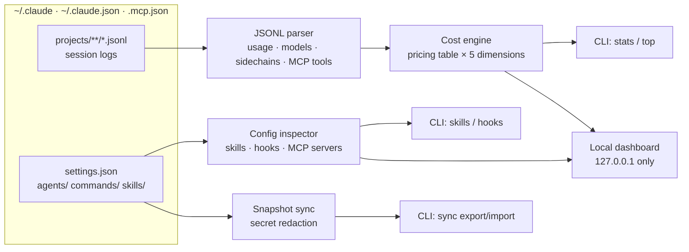

# claudedeck

[English](README.md) | [中文](README.zh.md) | [日本語](README.ja.md)

[](LICENSE) 

**Claude Code 的开源 local-first 管理台——每个 MCP server 的成本归因、skills 与 hooks 编辑器、配置同步。**


```bash
git clone https://github.com/JaydenCJ/claudedeck.git && cd claudedeck
npm install && npm run build && npm link
```

## 为什么是 claudedeck？

Claude Code 在 `~/.claude` 下写入了丰富的会话日志和配置，但你真正需要的成本答案散落在四层（本地 JSONL、`/cost`、Console、gateway），没有任何工具计量每个 MCP server 花了你多少钱，skills/hooks/配置也都靠手改文件。claudedeck 完全离线地解析本地日志，用一个工具回答所有这些问题——任何数据都不会离开你的机器。

|  | claudedeck | ccusage | claude-mem |
|---|---|---|---|
| 每 MCP server 的成本 | yes | no | no |
| 成本维度 | project · date · model · subagent · MCP server | date · session · block · model | no cost metering |
| skills 与 hooks 编辑（CLI + dashboard） | yes | no | no |
| 跨机配置快照同步 | yes | no | no |

## 特性

- **每 MCP server 的成本计量** —— 其它工具都没有的维度：每一轮的成本被归因到该轮调用的 MCP server，且各桶之和恒等于总成本。
- **五维度归因** —— 项目、日期、模型、subagent 与 MCP server，全部从本地 JSONL 会话日志计算。
- **真实的 subagent 记账** —— sidechain 轮次会被解析回启动它的 `Task` 调用，`code-reviewer` 与 `(main)` 的成本是实测的，不是猜的。
- **skills 与 hooks 编辑器** —— 在 CLI 或 dashboard 中浏览、新建、编辑、启停 skills、agents 与斜杠命令；hooks 的启停是非破坏性的（移入 `disabledHooks` 区块，完全可逆）。
- **可迁移的配置快照** —— `sync export` 把 `settings.json` + agents + commands + skills + `CLAUDE.md` 打包成一个 JSON，默认剔除敏感项（API key、token）并列出每一处脱敏；`sync import` 在另一台机器上应用。
- **零上传** —— dashboard 绑定 `127.0.0.1`，所有 CSS/JS 全部内联，不发起任何网络请求，没有遥测。
- **可脚本化 CLI** —— 每个命令都支持 `--json` 供管道使用，另有 `--since` / `--until` / `--dir` 过滤；gateway 或自定义定价只需一个 JSON 覆盖文件。

## 快速开始

安装：

```bash
git clone https://github.com/JaydenCJ/claudedeck.git && cd claudedeck
npm install && npm run build && npm link
```

运行最小示例：

```bash
claudedeck stats            # totals + per-model + per-project breakdown
claudedeck top --by mcp     # cost per MCP server
claudedeck serve            # dashboard at http://127.0.0.1:7433
```

输出：

```text
$ claudedeck top --by mcp
Top mcp by cost — .../.claude
mcp                                cost  calls  turns
------  ------------------------  -----  -----  -----
github  ████████████████████████  $0.04      3      2
slack   ██████████                $0.01      1      1
```

Linux、macOS 与 Windows 的预编译单文件二进制（无需 Node.js）将在后续正式 Release 中提供；当前请按上文从源码安装。

## 配置

| 项目 | 方式 |
|---|---|
| 数据目录 | `--dir <path>` 或 `CLAUDE_CONFIG_DIR`（默认 `~/.claude`） |
| 定价覆盖 | `~/.claude/claudedeck.pricing.json` 或 `--pricing <file>`——与 `claudedeck pricing --json` 输出同构 |
| 机器可读输出 | 任意命令加 `--json` |
| Dashboard 端口/主机 | `claudedeck serve -p 7433 --host 127.0.0.1` |

定价覆盖示例（USD / 百万 token，最长模型前缀优先匹配）：

```json
{
  "claude-opus-4-8": { "inputPerMTok": 5, "outputPerMTok": 25, "cacheWritePerMTok": 6.25, "cacheReadPerMTok": 0.5 },
  "my-gateway-model": { "inputPerMTok": 2, "outputPerMTok": 8, "cacheWritePerMTok": 2.5, "cacheReadPerMTok": 0.2 }
}
```

## 架构



### MCP 成本归因的工作方式

token 用量是按 assistant 轮次计费的，不是按工具调用——所以 claudedeck 把每一轮的成本归因到该轮调用的 MCP server（同一轮内多个不同 server 之间均分）。没有 MCP 调用的轮次归入 `(no-mcp)`。这是一种近似，但它保守、守恒（各桶之和恒等于总成本），并且终于让*「这个 server 真的在花我的钱」*变得可度量。

## 路线图

- [x] 沿项目 / 日期 / 模型 / subagent / MCP server 五个维度的成本归因，总额守恒
- [x] dashboard 内对 skills、agents 与斜杠命令的正文内容编辑
- [ ] dashboard 内编辑 hook 命令
- [ ] 实时跟踪模式（`claudedeck serve --watch`），流式更新
- [ ] 预算告警（`claudedeck watch --budget 50`）
- [ ] 导出 CSV / OpenTelemetry 指标
- [ ] 团队模式：合并多台机器的快照与统计（依然本地）

完整列表见 [open issues](https://github.com/JaydenCJ/claudedeck/issues)。

## 参与贡献

欢迎贡献——从 [good first issue](https://github.com/JaydenCJ/claudedeck/issues?q=is%3Aissue+is%3Aopen+label%3A%22good+first+issue%22) 入手，或到 [issues](https://github.com/JaydenCJ/claudedeck/issues) 发起讨论；开发环境、测试与提交规范见 [CONTRIBUTING.md](CONTRIBUTING.md)。

## 许可证

[MIT](LICENSE)
